## Table of Contents
1. [Overview](#overview)<br>
2. [Purpose](#purpose)<br>
3. [Installation](#installation)<br>
4. [Project Development: Method 1](#pdm01)<br>
5. [Method 1: Adding Content](#addingcontent)<br>
6. [Project Development: Method 2](#pdm02)<br>
7. [Method 2: Adding Remote](#addingremote)<br>
8. [Commands to Remember](#commands)<br>


<div id='overview'/>

## 1. Overview

This tutorial is to teach you how to use the basic controls and commands of Git using Github. Github is used by many software professionals
around the world. You can think of git as like a content tracker and a container to store your content. After you are through with this guide,
you should be more familiar in updating your project using the command line.

If this is your first time learning about Git, I recommend [learning the tutorial version](https://github.com/CPHT/ILP/blob/master/GitTutorial/TableofContents.md). This will help you get started understanding the commands

<div id='purpose'/>

## 2. Purpose

If you are new to software development, most applications require multiple developers. Depending on the number of developers working on an 
application, you may be working in tandem or alone. Yet in the end, all the developers are  working together. To help avoid version control conflicts, git acts as a middleman. 

Requirements also change consistently, so git can allow developers to move back
and review old versions of their code for updated changes.

When you are working on your version of code, you'll also want to be working on your own branch instead of committing to the
master branch or whatever your main landing branch is called. Your branch is what you have been changing and would like to add to the master branch before review. Some changes
can be minimal or alter the project entirely.

Git is also great for your technical documentation purposes. When you have well-made, professional documentation included in the 
wiki and the Readme files, you can capture how the progress is going and roadblocks that have been encountered. 
Consider the documentation as a story for your project. You never know if your project might inspire others to get into the field.
Also as you are uploading files, it becomes easier to use the git CLI vs dragging and dropping your files into one place. 

<div id='installation'/>

## 3. Installation

<b>Note</b>: I'll also be providing a different section for [installing on Windows]() as well.

For the tutorial, I'm going to focus on Linux/Mac users and Windows users as well
#### For linux

- Update your packages using to following command: ```sudo apt update```
- Install git and github with the following command: ```sudo apt-get install git```
- Check for installation: ```git --version```

<br><kbd>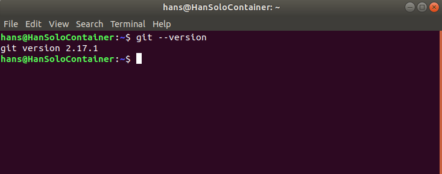<br><i>Figure 3.1: Checking git version installed.</i></kbd><br>


You can also enter the following command to set your default username and email for saving your work<br>

- ```git config --global user.name "Hans Lagenour"```<br>
- ```git config --global user.email "hanslagenour@gmail.com"```

If you are using Windows you will need to download [Gitbash](https://gitforwindows.org/).

<div id='pdm01'/>

## 4. Project Development 
When you are developing project, there are two ways you can upload projects and create new project. One way is to create the repository on Github, clone the link to your pc, and work from there. This is considered the preferred method when pushing to
Github. The other methods is working on a local project, deciding to create the repository on git hub and push it via remote.

We will cover both methods.

<div id='addingcontent'/>

## 5. Method 1: Project created from github repository

This is the most preferred method mainly for initializing a new project from scratch that is already added to git. You can create a new project easier this way and keep up with additions that you have for your project without worrying about initialization. 

### To start a new repository
- Go to your Github
- Left-Click on the plus dropdown icon which up in the top left corner of the screen.

<br><kbd>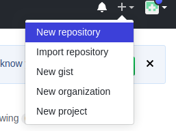<br><i>Figure 5.1: New repo selection.</i></kbd><br>


- Select New repository
- Give your repository a new name
- (Optional) go ahead and initialize a readme for notes.
- Fill in the information, including it being a private and public repo

<kbd>
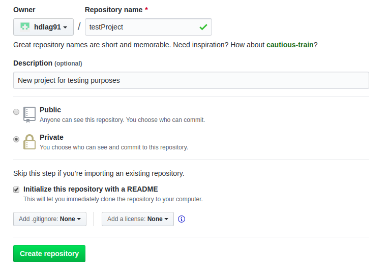<br><i>Figure 5.2: Git Repository name.</i></kbd><br>


At this point, you've developed a new repository that may or may not include a README.
Now you want to copy the
repository.This is accomplished by "cloning", which is retrieving a copy of
the repository on the server and creating a "clone" on your pc

- Open your Terminal/GitBash
- move to where you would want your project to rest by typing "cd"
- Clone your repository by typing the following: git clone [http address]

<kbd>
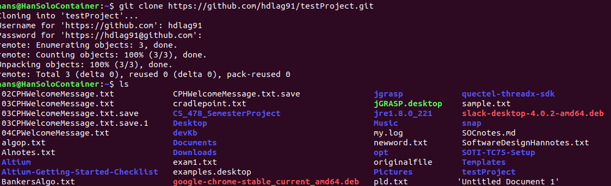<br><i>Figure 4: Successful Repo clone</i></kbd><br>

<b>Note</b>: You may get a warning message of an empty repository if you did not
initialize a readme. You can ignore this or add a readme later.

Congratulations! You now have new repository stashed on your computer.


## 6. Adding content

As you begin to add content into your repository, you will have to make sure
the folder contents update. When you are doing an update, you will be making
a commit. There are 4 commands to remember for commits.

- ```status``` = checks if anything new is included or updated.
- ```add``` = adds new file/s for the project in question.
- ```commit``` = adds description of your additions/changes.
- ```push``` = moves your updated work into your repository.


Before we start, add some content into your folder. For example, make a simple
home page or add a sample document. When you are creating new content, it would be wise to checkout a  new branch separate from master.

#### To create a new branch
- Type ```cd``` to move into your project
- Type the following command: ```git checkout -b newbranchname```
What this will do is checkout a new branch(-b) that you name and can work on.
When you create a branch, it serves as a clone of the master file updated at that
time. This helps reduce making any changes to the master before merging 
separate branches.

<b>Note</b>: Never commit anything to the master branch, especially code, until
review and merge conflicts are complete. 

 After you have made your changes:

- Move into your folder by typing ```cd```
- Start by typing "git status"

The ```git status``` command will bring up a message showing your un-tracked files. The 
un-tracked files represent files that have not been included in your updated
brach that you are working on.

<kbd>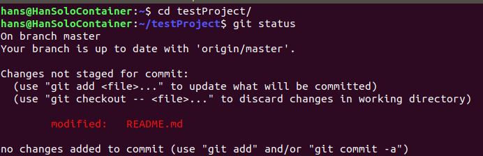<br><i>Figure 6.1: Checking git status in a repository.</i></kbd>

- Type in ```git add filename```. If you have multiple files or changes, you
can also type ```git add . ``` which adds all the new files and changes in your repo. 
- Type ```git status``` again. You should get the same message, but the files
that will be committed will turn green instead of red.

<kdb>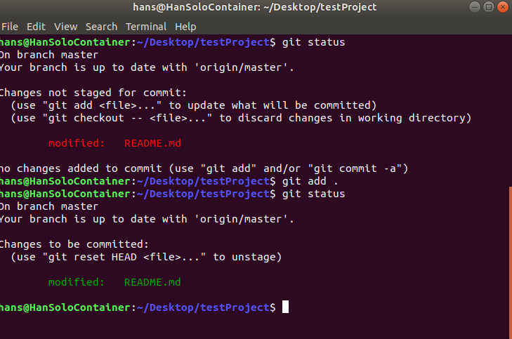<br><i>Figure 6.2: Git status successful additions.</i></kbd>

- Once you're sure of every file being add, type in ```git commit -m```

The commit command is used to save changes to your local repository. The
```-m``` will allow us to leave a message of the changes we did that can be
found in our history. Which at that point we will have a new message showing
how many files changed, and how many insertions have been added/deleted.

<kbd>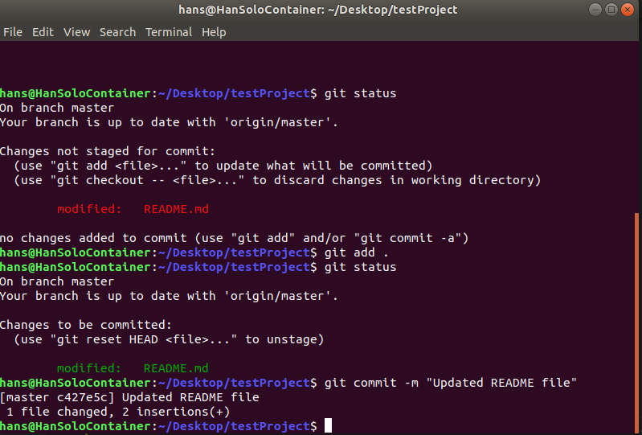<br><i>Figure 6.3: Git commit message.</i></kbd>

- Now type ```git push origin branchname```. ```Origin``` is usually the name of your
remote repository on the server. To know what the remote name is you can type
```git remote```.

<kbd>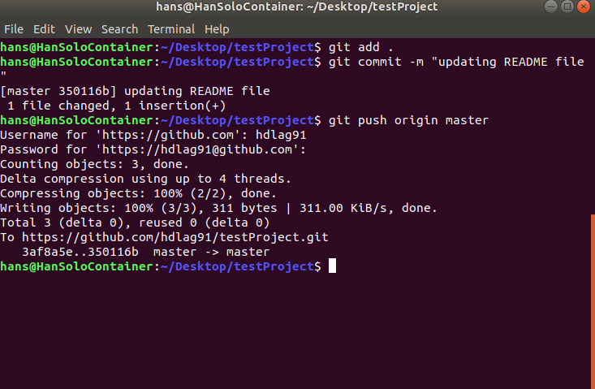<br><i>Figure 6.4: Git push to master.</i></kbd>

- Once you push your code up, refresh your repository and check to make sure
what you had appears.

<div id='pdm02'/>

## 7. Method 2 - Not Recommended
This section will allow you to create a new repository from an existing project
to upload to Github. This isn't the recommended method, but can help if you
decide to push a new repo for displaying. The reason for not being recommended
is that you will also have to create a remote repository instead of just one
already initialized from your repo.

- Type ```cd``` into your chosen project directory.
- Type into the terminal: ```git init```

**Note**: You may need to type ```git status``` after incase there are files that
you do not want to include in the directory.
- Add your files by typing ```git add filename1 filnames2``` or for multiple files
type ```git add . ```
- Check the status of your added files, they should be in green.

<kbd>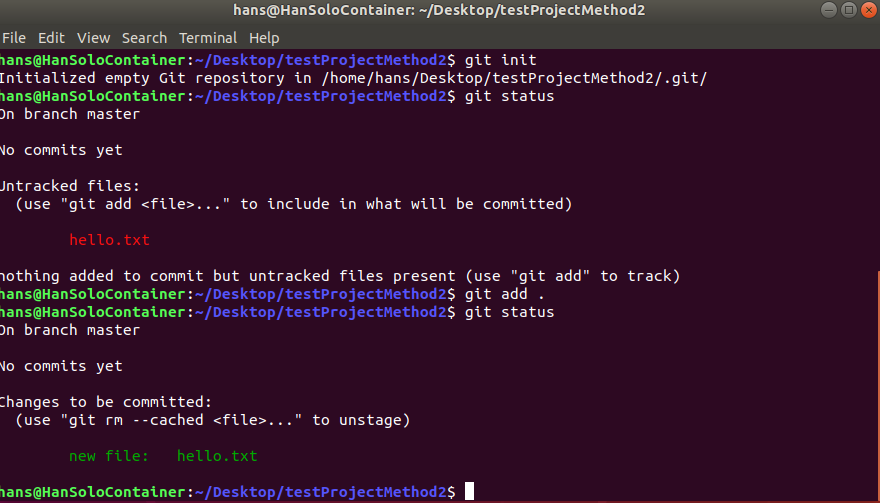<br><i>Figure 7.1: Initializing empty repository</i></kbd>


<div id='addingremote'/>

## 8. Adding the remote

Just as the previous steps above:
- Create a new repository.
- Select a name and/or a description.
- Choose to either be public or private.
- Do not initialize a README.

You will be presented with the Quick Started screen with multiple options
<kbd>
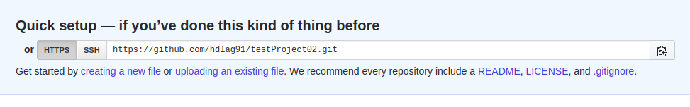<br><i>Figure 8.1: Git creating existing repo</i></kbd>

- Copy the Https address
- Go back to your terminal
- Type the following command: ```git remote add origin httpsaddress```

<kbd>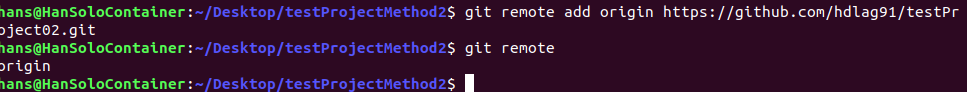<br><i>Figure 8.2: Git remote add successful</i></kbd>

Once you type this command, you will create a new remote repo added to your
Github profile. You'll need to check to see if remote has been added. You should 
get the message origin. You can then change the remote name (usually master)

```git remote add remotename httpsaddress```

<div id='commands'/>

## 9. Commands to remember

The commands listed here can be used for quick reference, however we include
them here as to why you need to know these commands.

- ```git pull reponame``` = pulls repository that hase any changes to yours.
- ```git clone repoaddress``` = clones a direct copy of the repo to your computer.
- ```git branch -a``` = lists all the branches associated with the project. The
branch you are currently on will have a * next to it. 
- ```git checkout -b branchname``` = creates a new branch and switches you over to
it to make any changes without corrupting the master branch.
- ```git push origin branchname``` = pushes changes into your branch only.